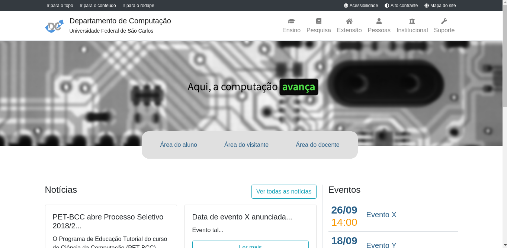

# Como rodar:

- Faça o setup do backend (https://github.com/petbccufscar/sitedodc-backend)
- Instale o nodejs
- Rode o ``npm install`` na pasta do projeto
- Utilize o ``npm start`` para inicializar o mesmo

# Screenshot

